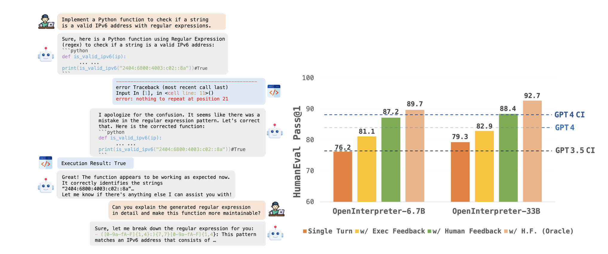

# Highlights

</img>

This project provides a guide to fine-tuning the OpenCodeInterpreter-DS-6.7B coding LLM model for text-to-SQL code generation using the QLoRA+ technique. QLoRA+ is an improvement over the standard LoRA (Low-Rank Adaptation) approach that allows for different learning rates for the adapter matrices, significantly reducing the number of trainable parameters while maintaining model performance and speeding up fine-tuning by up to 2x. The fine-tuned model can generate accurate SQL queries based on natural language questions and database schemas. A Gradio app is created to showcase the model's capabilities, allowing users to interact with it in real-time by providing a schema and asking questions

See my [website](https://jordandeklerk.github.io/project/opencode/) for the full project.
